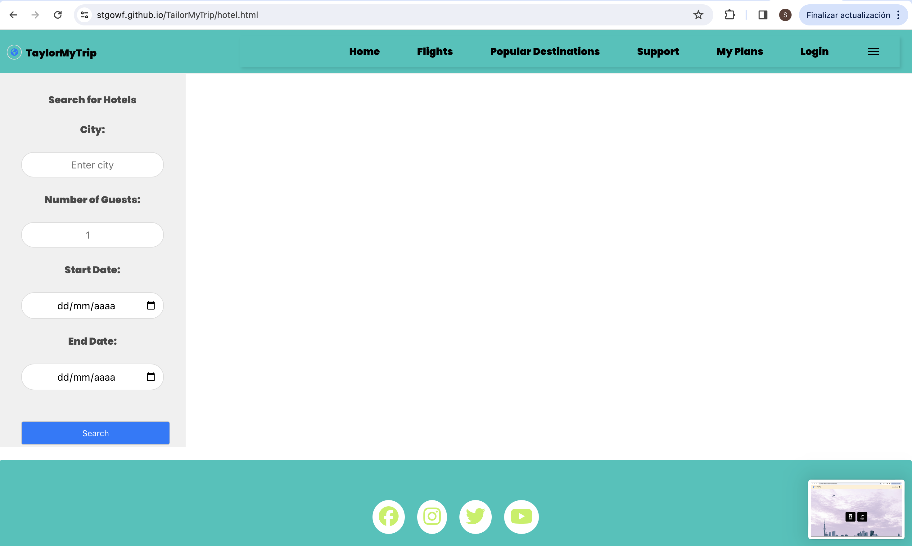

# TailorMyTrip

## Summary

TailorMyTrip reimagines travel organization by offering an all-in-one platform for booking flights and hotels. Utilizing APIs from top booking services, it presents real-time updates and competitive rates for global flights and stays. Its user-friendly design allows for quick comparisons and storage of travel plans, turning trip organization into a delight.

## Key Features

Global Flight and Hotel Finder: Search capability for worldwide flights and accommodations.
Extensive Details Provided: Offers in-depth information on flights and hotels, including timetables, costs, reviews, and services.
Flexible Date Options: Pick specific dates for flights' departure and return, as well as hotels' check-in and check-out.
'My Plans' Organizer: Save and manage flight and hotel picks in a dedicated space for future reference and booking.
Visual Previews

## Screenshots

## Interactive Demonstration

[Engage with TailorMyTrip](https://stgowf.github.io/TailorMyTrip/)

## How to Use

- Select either flight or hotel booking from the main page.
- Input necessary details like destination, dates, and number of travelers or guests.
- Peruse the options, saving any that align with your travel goals to 'My Plans'.
- Review your 'My Plans' collection, complete with direct booking links.

## Technical Framework

- JavaScript
- Fetch API for network communication
- DataCrawler's Booking COM API via RapidAPI for current flight data
- Tipsters CO's Booking com API via RapidAPI for hotel explorations and reservations
- Local Implementation

## Getting Started

1. Download this repository to your computer.
2. Open index.html with a browser to initiate the program.

## Participation and Contributions

Your contributions to TailorMyTrip are valuable! Enhancements, bug resolutions, or code refinements are all welcome. To contribute:

1. Fork this repository.
2. Create a branch for your update.
3. Commit your changes.
4. Submit a pull request with your branch.

We'll review submissions for potential integration into the project.

Plan your next adventure effortlessly with TailorMyTrip!