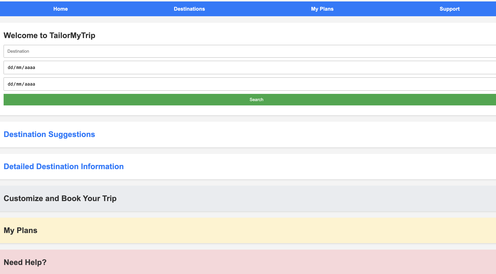

 

# **DevDream Team Project One Proposal**

**Team Members:** Piattie Hadi, Lovely Tautua’a, Santiago Weinstein, Isaac Santos, Magali Zavala, Aaron Gutierrez

## **Title: TaylorMyTrip**

## **User Story**
As a travel enthusiast, I want a web page where I can easily plan and customize my trip, so that I can have a holiday tailored to my preferences and interests.

### **Criteria**
1. The webpage should allow me to select my travel destination from a wide range of global locations.
2. I should be able to input my travel dates and preferences, such as budget, travel style (luxury, budget-friendly, etc.).
3. The webpage should offer suggestions for flights and Hotels based on my filters and preferences.
4. The webpage should provide detailed information about each Flight, including Departure, arrival, and price.
5. There should be a feature to save and modify my travel plan.
6. The webpage should allow for user reviews and ratings of hotels.

This user story focuses on a comprehensive, user-friendly experience for trip planning and customize their favorite plan, offering personalized options and seamless integration of travel services.

---

## **Technologies**
- HTML
- CSS
- Web-Server APIs:
  - Flight Data API: Skyscanner API
  - Hotel Booking API: Booking.com API

---

## **Features**

### **1. Homepage**:
   - **Top Navigation Bar:** Includes links to Home, Destinations, My Plans, and Support.
   - **Main Search Area:** A prominent search box where users can enter their travel destination.
   - **Date Picker:** Users can input their travel dates.
   - **Preference Filters:** Options to filter by budget, travel style, and interests.
   - **Destination Highlights:** A section showcasing popular destinations or special deals.

### **2. Destination Suggestions Page**:
   - **List/Grid View:** Display of suggested destinations based on user input.
   - **Filter Options:** Ability to refine search by different criteria (price, type of experience, etc.).
   - **Destination Cards:** Each card shows a brief overview of the destination, with an option to explore more.

### **3. Detailed Destination Page**:
   - **Overview Section:** Description of the destination, weather info, cultural norms, and travel advisories.
   - **Accommodation Options:** A list of hotels with filter options (price, ratings, etc.).
   - **Activity Suggestions:** Curated list of activities with details and booking options.
   - **Flight Options:** Flight suggestions and booking feature.
   - **Interactive Map:** Showing locations of hotels, attractions, and activities.

### **4. Customization & Booking Page**:
   - **Booking Section:** Option to book flights, hotels, and activities directly.
   - **Price Summary:** Total cost of the trip with the option to modify selection.

### **5. My Plans Page**:
   - **List of Saved Trips:** Users can view, edit, or delete their planned trips.

### **6. Support/Help Page**:
   - **FAQ Section:** Answers to common queries.
   - **Live Chat/Contact Form:** For additional support or inquiries.

---

## **Screenshot**

